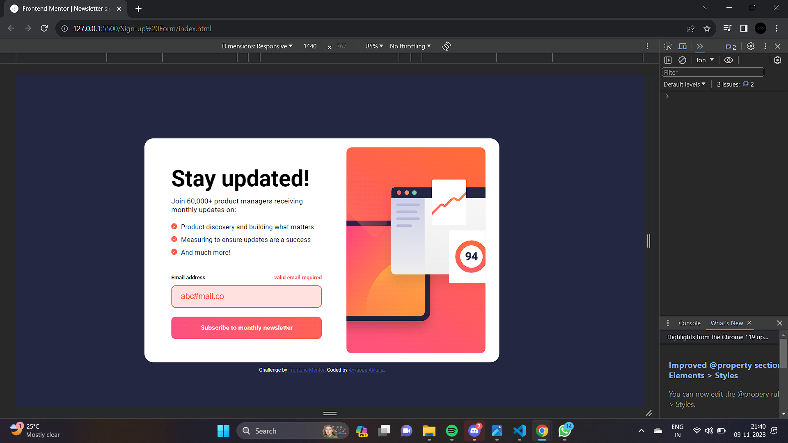

# Frontend Mentor - Newsletter sign-up form with success message solution

This is a solution to the [Newsletter sign-up form with success message challenge on Frontend Mentor](https://www.frontendmentor.io/challenges/newsletter-signup-form-with-success-message-3FC1AZbNrv). Frontend Mentor challenges help you improve your coding skills by building realistic projects.

## Table of contents

- [Overview](#overview)
  - [The challenge](#the-challenge)
  - [Screenshot](#screenshot)
  - [Links](#links)
- [My process](#my-process)
  - [Built with](#built-with)
  - [What I learned](#what-i-learned)
  - [Continued development](#continued-development)
  - [Useful resources](#useful-resources)
- [Author](#author)
- [Acknowledgments](#acknowledgments)

## Overview

You can see a live demo of this project [here](https://your-live-demo-url.com).

### The challenge

Users should be able to:

- Add their email and submit the form
- See a success message with their email after successfully submitting the form
- See form validation messages if:
  - The field is left empty
  - The email address is not formatted correctly
- View the optimal layout for the interface depending on their device's screen size
- See hover and focus states for all interactive elements on the page

### Screenshot

### Links

- Solution URL: (https://github.com/Ayyappanakkala/Sign-up-form-with-success-message.git)
- Live Site URL: [Add live site URL here](https://your-live-site-url.com)

## My Process

In this section, I'll outline the steps I took to complete the "Newsletter Sign-up Form with Success Message" project.

1. **Project Setup**: I began by setting up the project structure. I created the necessary HTML, CSS, and JavaScript files, and organized my project directory.

2. **HTML Structure**: I created the basic HTML structure for the web page. I added the form, input field, labels, and other necessary elements.

3. **Styling**: I started with the styling of the project using CSS. I used CSS Flexbox for the layout to make it responsive to different screen sizes. I applied colors and typography to match the design requirements.

4. **JavaScript Functionality**: I added JavaScript to handle form validation and success message display. When the user submits the form, I check if the email address is valid and show the success message or validation message accordingly.

5. **Responsive Design**: I made the project responsive by adding media queries to adjust the layout and styles for smaller screens. This ensures a good user experience on mobile devices.

6. **Testing**: I thoroughly tested the project on various devices and browsers to ensure compatibility and responsiveness.

7. **Documentation**: I wrote this README file to provide project information, usage instructions, and acknowledgments.

8. **Final Touches**: I made final adjustments to ensure the project meets the challenge requirements and looks polished.

This project challenged me to improve my HTML, CSS, and JavaScript skills, especially in handling form interactions and responsive design. It was a great learning experience, and I'm happy with the result.

### Built with

This project was built using the following technologies and tools:

- **HTML5:** Used for structuring the content of the web page.
- **CSS3:** Used for styling the web page and creating a responsive design.
- **JavaScript:** Used for form validation and handling user interactions.

## What I Learned

During the development of this project, I learned and gained the following insights:

- **Form Validation:** I improved my understanding of form validation in JavaScript, ensuring that user input meets specific criteria before submission.

- **Responsive Design:** I honed my skills in creating responsive web designs that adapt to various screen sizes and devices using CSS media queries.

- **DOM Manipulation:** I learned how to manipulate the Document Object Model (DOM) using JavaScript to dynamically update the content and appearance of web pages.

- **Project Structuring:** I refined my project structuring skills, keeping my HTML, CSS, and JavaScript organized and maintainable.

- **CSS Styling:** I gained experience in styling web pages using CSS, including applying custom colors, fonts, and layouts to meet design specifications.

- **Frontend Development Best Practices:** I practiced and implemented best practices in front-end development, ensuring clean and efficient code.

- **Debugging:** I enhanced my debugging skills, diagnosing and fixing issues in both HTML and JavaScript code.

- **Project Documentation:** I learned the importance of clear and concise project documentation, such as writing a README to guide users and collaborators.

These lessons and skills will undoubtedly benefit me in future web development projects and help me grow as a front-end developer.

## Continued Development

While I'm pleased with the current state of the project, there are areas I plan to focus on for continued development and enhancement:

- **Enhanced User Experience:** I want to further improve the user experience by adding more interactive elements and animations to make the website more engaging.

- **Accessibility:** I intend to make the project more accessible by ensuring it complies with web accessibility standards and guidelines, making it usable for all users.

- **Testing and Validation:** I plan to perform additional testing to ensure compatibility across a wider range of browsers and devices, along with rigorous testing for validation and error handling.

- **Localization:** To reach a global audience, I aim to implement multi-language support and localization features to make the content accessible to users from different regions.

- **Performance Optimization:** I will work on optimizing the website's performance, focusing on faster loading times and reduced resource consumption.

- **Security:** To enhance security, I will review and implement best practices for securing user data and forms.

- **Feedback Mechanism:** I'm considering adding a feedback mechanism to gather user opinions and suggestions for continuous improvement.

- **Adding New Features:** I'll explore the possibility of adding new features and functionalities to make the project more versatile and valuable to users.

These are my current plans for the project's continued development, and I'm excited to see how it evolves over time.

## Useful Resources

During the sign-up form with success message solution component project, I found the following resources helpful:

- [Frontend Mentor](https://www.frontendmentor.io?ref=challenge): The Frontend Mentor platform, which hosted this challenge, was an excellent resource for honing my front-end development skills and finding real-world projects to work on.

- [Google Fonts](https://fonts.google.com/): I used Google Fonts to access a wide variety of fonts and improve the typography of the project.

These resources played a significant role in guiding me through the project and enhancing my development skills. I recommend checking them out if you're looking to expand your knowledge and capabilities as a front-end developer.

## Author

- Website - [Ayyappa Akkala](https://github.com/Ayyappanakkala/Personal_Portfolio.git)
- Frontend Mentor - [@Ayyappanakkala](https://www.frontendmentor.io/profile/@Ayyappanakkala)

## Acknowledgments

I'd like to extend my gratitude to the following individuals and organizations who contributed to the success of this project:

- **Frontend Mentor**: I'm thankful to Frontend Mentor for providing a platform with real-world challenges that allowed me to apply and improve my front-end development skills.

Acknowledging the contributions and support you received is a way to show appreciation and build positive relationships within the development community.
